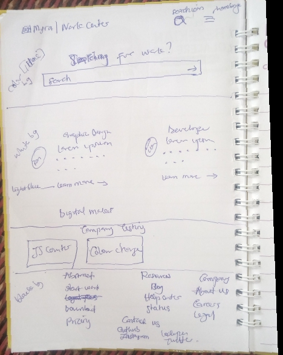

# Myra-Landing-page
Website for Work search

## Table of contents

- [Overview](#overview)
 - [The challenge](#the-challenge)
  - [The draft](#the-draft)
  - [Video](#video)
  - [Links](#links)
- [My process](#my-process)
  - [Built with](#built-with)
  - [Thoughts and Troubles](#thoughts-and-troubles)
  - [What I learned and used](#what-i-learned-and-used)
  - [Continued development](#continued-development)
  - [Useful resources](#useful-resources)
- [Author](#author)

## Overview

### The challenge

It should:

- Responsive nav bar and hamburger menu
- Animation
- Add previous codes/site to display within 

### The draft

### Video 

https://user-images.githubusercontent.com/104025961/230787044-9d278a0b-f27f-4f29-bf92-50882ac2183d.mp4

### Links

- Solution URL: [https://github.com/f-lajoc/Color-changing-background] 
- Live Site URL: [https://f-lajoc.github.io/Color-changing-background/]

## My process

### Built with

- Css Animaion
- Bootstrap
- Flexbox
- JavaScript
- Mobile-first workflow

### Thoughts and Troubles
- coding with phone is stressful but i like the outcome of this project, getting a PC is my priority now

- i wanted to make card slider at the company products section but bootstrap carousel wasn't working and i didn't want to choose from scratch, I'll try it in my next project

- The search icon was supposed to be at the front of the hamburger menu but it wasn't working since i used bootstrap for the nav menu,i guess there should be a way around it, anyways i decided to change the position

- There is space at the top of the page which i couldn't seem to remove, i think it might be due to the bootstrap navigation 

- The embed site is bringing an error anytime i check the site ...i have no idea how to stop it iho

### What I learned and used

- I used bootstrap for the navigation, the button and input text, using css library is easy

- using illustration images makes the site popout more

- I'm getting better at manipulating flex

- I want to use another hosting site like vercel, netlifu

- First time I'll embed a site in another

I used 

- embed to add a site within a card
- animation generator for my animations 

### Continued development

I should learn Tailwind CSS as recommended in place of bootstrap 
- Keep practicing Flex
- Grid
- Transition
- Animation
- Responsiveness 

### Useful resources
- [https://coolors.co]- Coolors to generate palatte
- [https://css-tricks.com/snippets/css/a-guide-to-flexbox/]- CSS Flexbox, i use it most times i want to use flex properties
- [https://webcode.tools/generators/css/keyframe-animation]- Animation generator, i just learnt of this and it's so easy& useful since i can't really animate from scratch
- [https://www.lipsum.com/]- lorem ipsum generator, useful since my Android code editor doesn't have extension, so i copy and paste from here

## Author

- Twitter - [@lajoc__](https://www.twitter.com/lajoc__)
- Instagram - [@lajoc_devs](https://www.instagram.com/lajoc_devs)
- Codepen - [@lajoc__](https://codepen.io/lajoc__/pen/bGvYWjR)
- Github - [https://github.com/f-lajoc ]

